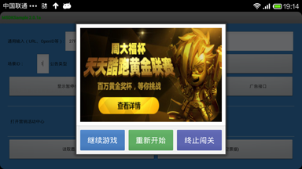

MSDK 광고 관련 모듈
===
1. 개요
---
게임에 일시정지 버튼이 설정되어 사용자가 버튼을 누르면 일시정지 대화창이 나타나고, 돌아가기 버튼을 누르면 종료 대화창이 팝업된다. MSDK2.1부터 MSDK에 일시정지와 종료를 표시하는 사용자정의 대화창이 추가되었다. 아래 그림 참조:

 

게임에 광고가 투입될 경우, 아래 그림과 같은 화면을 표시한다. 다수 광고가 있을 경우에는 일정 시간 후 자동으로 다음 광고로 전환된다. 손가락으로 밀어서 다음 광고를 시작할 수도 있다.

 

그중, 버튼 수량은 __adconfig.ini__에서 설정할 수 있으며 __2__ 또는 __3__개로만 설정이 가능하다. 그림3의 일시정지 위치 대화창에는 “계속 플레이”, “다시 시작”, “도전종료” 등 3개 버튼이 있다. 버튼 문자는 변경할 수 있고, 버튼을 클릭하면 대화창이 사라진다. MSDK는 게임에 인터페이스 OnADNotify 통지를 콜백하고 이 함수에서 구체적인 로직을 구현한다. 모든 View에는 __android:tag__ 속성이 있다. 게임은 부동한 tag명을 통해 어느 버튼에 응답하는지 구분한다. 기본 레이아웃을 사용할 경우, 그림3 예시처럼 “계속 플레이”의 viewTag는 `FIRST_BTN_POSITION`, “다시 시작”의 viewTag는 `SECOND_BTN_POSITION`, “도전 종료”의 viewTag는 `THIRD_BTN_POSITION`이다. 게임에서 돌아가기 버튼 클릭시, MSDK는 게임에 인터페이스 `OnADBackPressedNotify` 통지를 콜백한다.

또한, 내장 브라우저를 사용하여 네비게이션바 광고를 표시한다. 네비게이션바 광고가 있을 경우, 내장 브라우저 하단의 네비게이션바에 그림5처럼 추천 버튼이 표시된다. 클릭하여 네비게이션바 광고 페이지를 띄운다.
 

2. 게임 액세스
---
###Step 1: 액세스 설정
__MSDKSample/assets/adconfig.ini를 게임의 대응하는 프로젝트 assets 디렉토리에 복사하고 설정을 진행한다__

assets/adconfig.ini에서 광고 실행 스위치 설정: 

    MSDK_AD=true //일 경우 광고 실행

在assets/adconfig.ini에서 광고 버튼 수량 설정:

    ;MSDK 일시정지 위치 광고 버튼 수량은 2, 3만 입력이 가능하며 기본값은 2이다
    ;AD_PAUSE=2
    AD_PAUSE=3
    
    ;MSDK 종료위치 광고 버튼 수량은 2, 3만 입력이 가능하며 기본값은 2이다
    ;AD_STOP=3
    AD_STOP=2

###Step 2: 게임 Activity 라이프사이클 데이터 모니터링
게임 메인 Acitivity의 onResume과 onPause에서 각각 MSDK 대응 방법을 호출한다. 반드시 호출해야 한다

    @Override
    protected void onResume() {
        super.onResume();
        WGPlatform.onResume();
    }
    @Override
    protected void onPause() {
        super.onPause();
        WGPlatform.onPause();
    }
    @Override
    protected void onDestroy() {
        super.onDestroy();
        WGPlatform.onDestory(this);
    }

###Step 3: 콜백 함수의 설정

3.1 버튼을 클릭하거나 돌아가기 버튼을 누른 후 msdk는 게임으로 콜백하여 게임에서 처리 로직을 추가한다. Java 호출 방법은 다음 방식으로 처리한다. MSDKSample 중 com.example.wegame.MainActivity 예시처럼 onCreate에 호출 로직을 추가한다.

    public class ADRet {
        // 기본 레이아웃의 viewTag
        // FIRST_BTN_POSITION 
        // SECOND_BTN_POSITION 
        // THIRD_BTN_POSITION 
        // 게임이 버튼 View의 android:tag를 변경하면 viewTag는 해당하는 값이다
        public String viewTag = "";
        public eADType scene;
    }

    // 광고 버튼 클릭시 콜백
    class MsdkADCallback implements WGADObserver {

        @Override
        public void OnADNotify(ADRet ret) {
            Logger.d("Java MsdkADCallback OnADNotify:" + ret.toString());
            // TODO: GAME 이곳에 광고 콜백에 대한 처리 추가
        }

        @Override
        public void OnADBackPressedNotify(ADRet ret) {
            Logger.d("Java MsdkADCallback OnADBackPressedNotify:" + ret.toString());
            // TODO GAME 돌아가기 버튼을 눌러 광고를 끌 경우, close 방법을 호출해야 한다
            WGPlatform.WGCloseAD(ret.scene);
        }
    }

    if (LANG.equals("java")) {
        WGPlatform.WGSetObserver(new MsdkCallback());
        // 광고의 콜백 설정
        WGPlatform.WGSetADObserver(new MsdkADCallback());
    }

3.2 CPP 방식 콜백의 설정

MSDKSample中com_example_wegame_PlatformTest.cpp에서 제시한 바와 같이 전역 콜백 객체 추가

    // 광고의 콜백
    class ADCAllback: public WGADObserver {

        virtual void OnADNotify(ADRet& adRet) {
            // 게임은 이곳에 광고를 표시하고 버튼을 클릭하는 처리 로직 추가
            LOGD("ADCAllback OnADNotify Tag:%s ", adRet.viewTag.c_str());
            if(adRet.scene == Type_Pause) {
                LOGD("ADCAllback OnADNotify scene:Type_Pause%s", "");
            } else if(adRet.scene == Type_Stop) {
                LOGD("ADCAllback OnADNotify scene:Type_Stop%s", "");
            }
        }

        virtual void OnADBackPressedNotify(ADRet& adRet) {
             // 게임은 이곳에 광고 표시 후 돌아가기 버튼을 누르는 처리 로직 추가
            LOGD("ADCAllback OnADBackPressedNotify Tag:%s ", adRet.viewTag.c_str());
            if(adRet.scene == Type_Pause) {
                LOGD("ADCAllback OnADBackPressedNotify scene:Type_Pause%s", "");
                // 광고 대화창 종료에 주의
                WGPlatform::GetInstance()->WGCloseAD(adRet.scene);
            } else if(adRet.scene == Type_Stop) {
                LOGD("ADCAllback OnADBackPressedNotify scene:Type_Stop%s", "");
                // 광고 대화창 종료에 주의
                WGPlatform::GetInstance()->WGCloseAD(adRet.scene);
            }
        }
    };

    // 광고 전역 콜백 객체
    ADCAllback ad_callback;

    // 초기화
    JNIEXPORT jint JNICALL JNI_OnLoad(JavaVM* vm, void* reserved) {
        //TODO GAME C++ 계층 초기화, 반드시 게임 메인 Activity의 onCreate 전에 호출되어야 한다
        WGPlatform::GetInstance()->init(vm);
        WGPlatform::GetInstance()->WGSetObserver(&g_Test);
        // 광고 콜백 설정
    WGPlatform::GetInstance()->WGSetADObserver(&ad_callback);
        
        WGPlatform::GetInstance()->WGSetSaveUpdateObserver(&callback);
        return JNI_VERSION_1_4;
    }

###Step 4: 호출 방법 설명
JAVA에서 일시정지와 종료 위치 광고창을 출력하거나 닫는 데 사용하는 함수 호출

    /**
     * @param scene 광고 씬 ID, 비워둘 수 없다
     * Type_Pause(1) 일시정지 위치 광고 표시
     * Type_Stop(2) 종료 위치 광고 표시
    */
    WGPlatform.WGShowAD(eADType scene); 
    WGPlatform.WGCloseAD (eADType scene);

CPP에서 일시정지 위치와 종료 위치 광고 대화창을 표시하거나 종료하는데 사용하는 함수 호출
전역 열거형 정의는 WGPublicDefine.h에 있다

    typedef enum _eADType
    {
        Type_Pause  = 1, // 일시정지 위치 광고
        Type_Stop = 2, // 종료 위치 광고
    }eADType;

일시정지 위치와 종료 위치 광고를 표시하거나 종료하는 방법

    WGPlatform::GetInstance()->WGCloseAD(Type_Pause);
    WGPlatform::GetInstance()->WGCloseAD(Type_Stop);

###Step 5: 리소스 파일 설명

5.1 파일 경로:

【1】MSDKLibrary\res\layout\msdk_ad_pause_three_default.xml

【2】MSDKLibrary\res\layout\msdk_ad_pause_three_show.xml

【3】MSDKLibrary\res\layout\msdk_ad_pause_two_default.xml

【4】MSDKLibrary\res\layout\msdk_ad_pause_two_show.xml

【5】MSDKLibrary\res\layout\msdk_ad_stop_three_default.xml

【6】MSDKLibrary\res\layout\msdk_ad_stop_three_show.xml

【7】MSDKLibrary\res\layout\msdk_ad_stop_two_default.xml

【8】MSDKLibrary\res\layout\msdk_ad_stop_two_show.xml

그중:

【1】msdk_ad_pause_three_default.xml 그림1 효과에 해당

【2】msdk_ad_stop_three_default.xml효과도 마찬가지이지만 문자가 다르다. 문자는 MSDKLibrary\res\values\msdk_ad_strings.xml에서 변경할 수 있다.

 

【3】msdk_ad_stop_two_default.xml和msdk_ad_pause_two_default.xml 그림2 해당

【4】msdk_ad_pause_three_show.xml和msdk_ad_stop_three_show.xml 그림3 해당

【5】msdk_ad_stop_two_show.xml和msdk_ad_pause_two_show.xml 그림4 해당

**설명: 게임은 MSDKLibrary\res에서 직접 변경할 수 있다. 광고 관련 리소스는 모두 msdk_ad로 시작된다. 대화창의 버튼 숫자가 확정되어 있기에 실제로 모든 게임은 레이아웃 파일 4개만 필요한다. 다른 제약은 Step 7을 참조하시기 바란다. **

###Step 6: 게임의 레이아웃 파일 설정 설명

6.1 MSDKLibrary는 변경될 수 있고 후속적인 업데이트는 대조 복사해야 하기에 불편함을 줄이기 위해 msdk는 일부 구성 항목 처리를 진행했다. 게임은 자신의 프로젝트 디렉토리에서 레이아웃 파일을 정의한 후 xml파일명을 assets/adconfig.ini에 기입하면 된다. 물론 이러한 레이아웃 파일은 일정한 제약을 주어야 한다.

6.2설정 절차

우선, 레이아웃을 설정할 수 있는 스위치 실행

    ;MSDK 광고 레이아웃 파일 설정 스위치, 기본값은 false
    AD_NEED_CONFIG_LAYOUT=false

그다음, 프로젝트에서 대화창 레이아웃 파일 정의

마지막으로, 구성 파일에서 설정 진행

    ;MSDK일시정지 위치 광고 대화창의 게임 자체정의 레이아웃 설정, AD_NEED_CONFIG_LAYOUT=true일 때에만 유효
    ;레이아웃 파일의 버튼 수량은 AD_PAUSE와 일치해야 한다
    ;광고가 없을 때 대화창을 보여주는 레이아웃 파일
    AD_LAYOUT_PAUSE_DEFAULT=myad_pause_default
    ;광고가 있을 때 대화창을 보여주는 레이아웃 파일
    AD_LAYOUT_PAUSE_SHOW=myad_pause_show

    ;MSDK종료위치 광고 대화창의 게임 자체정의 레이아웃 설정
    ;레이아웃 파일의 버튼 수량은 AD_STOP과 일치해야 한다
    ; 광고가 없을 때 대화창을 보여주는 레이아웃 파일
    AD_LAYOUT_STOP_DEFAULT=myad_stop_default
    ; 광고가 있을 때 대화창을 보여주는 레이아웃 파일
    AD_LAYOUT_STOP_SHOW=myad_stop_show

예하면, MSDKSample/res/layout에서 4개 레이아웃 파일과 구성 파일에서의 작성법 정의

 

###Step 7: 리소스와 레이아웃 파일 수정 주의사항

**1.	버튼 id는 반드시 msdk_ad_btn_1, msdk_ad_btn_2, msdk_ad_btn_3으로 해야 한다. 그렇지 않으면 대화창 호출시 버튼 id를 찾을 수 없게 된다**

**2.	광고가 있을 경우 이미지 롤링 효과의 레이아웃을 유지하시기 바란다. 즉 아래 붉은선으로 표시된 부분의 id명 ad_view_pager를 변경하지 말고 이미지 사이즈를 300dp*200dp**로 유지해야 한다
