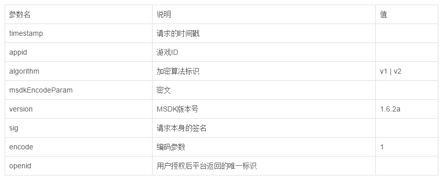
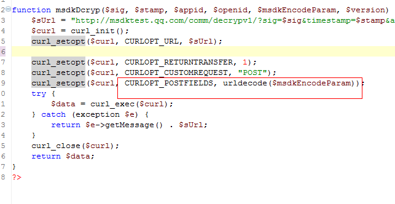

MSDK 내장 브라우저 관련 모듈
======
MSDK는 내장 브라우저를 제공한다. 이 내장 Webview는 보안성이나 성능 등 면에서 시스템 내장 Webview보다 뛰어나며 QQ와 위챗에 공유하는 기능도 제공한다. 게임 안에서  Web페이지를 실행하여 마케팅 이벤트창, 게시판, 공략 등 페이지를 방문할 때 내장 브라우저 액세스는 2개 절차를 진행해야 한다.
액세스 설정
------
MSDK2.0.0a 이전은 다음 방식으로 설정한다.

    <activity
       android:name="com.tencent.mtt.spcialcall.SpecialCallActivity"
       android:configChanges="orientation|keyboardHidden|navigation|fontScale|locale|screenSize"
       android:screenOrientation="unspecified"
       android:theme="@style/ThrdCallActivity"
       android:exported="false"
       android:windowSoftInputMode="adjustPan" >
    <intent-filter>
       <action android:name="com.tencent.QQBrowser.action.VIEWLITE" />
       <category android:name="android.intent.category.DEFAULT" />
       <category android:name="android.intent.category.BROWSABLE" />
       <data android:scheme="http" />
       <data android:scheme="https" />
       <data android:scheme="file" />
    </intent-filter>
    </activity>
MSDK2.0.0a 및 그 이후부터는 다음 방식으로 설정한다.

    <activity
       android:name="com.tencent.msdk.webview.WebViewActivity"
       android:configChanges="orientation|screenSize|keyboardHidden|navigation|fontScale|locale"
       android:theme="@android:style/Theme.NoTitleBar"
       android:screenOrientation="unspecified"
       android:windowSoftInputMode="adjustPan">
    </activity>

내장 브라우저가 줄곧 가로 화면을 유지하려면 `android:screenOrientation="unspecified"`를 다음과 같이 변경한다.
`android:screenOrientation="landscape"`

내장 브라우저가 줄곧 세로 화면을 유지하려면 `android:screenOrientation="unspecified"`를 다음과 같이 변경한다.
`android:screenOrientation="portrait"`

버전 1.9.0으로 업데이트되었으면 1.9.0 이전의 설정을 삭제하고 새로운 설정을 추가하면 된다.

브라우저 실행
------
WGOpenUrl 인터페이스를 호출하여 URL을 전송하면 SDK가 제공한 Webview를 사용할 수 있다. WGOpenUrl 인터페이스 설명:

    /**
      *내장 브라우저 실행. 이 내장 Webview는 보안성이나 성능이 시스템 내장 Webview보다 뛰어나다. 휴대폰에 QQ 브라우저가 설치되어 있으면 QQ브라우저 커널을 사용하여 더욱 탁월한 성능을 보여주며 내장 브라우저에서 QQ와 위챗에 공유하는 기능도 제공한다
      *@param openUrl 방문할 url
      */
    void WGOpenUrl(unsigned char * openUrl);

호출 샘플 코드:

    WGPlatform::GetInstance()->WGOpenUrl(cOpenUrl);

표시 효과:

 

투과전송 파라미터 설명
------
###1. 로그인 상태의 암호화 전송
게임에 로그인한 후 내장 브라우저를 통해 웹페이지를 방문하면 암호화된 로그인 상태 파라미터를 전송한다. 구체 절차:

1.MSDK가 이런 파라미터를 암호화하여 페이지에 전송:

2.페이지에서 암호문을 획득한 후 MSDK 백그라운드 디코딩 인터페이스를 통해 평문을 얻는다;

3.평문의 Token으로 로그인 인증을 진행한다.

###2. 암호화된 데이터
암호화할 로그인 상태 파라미터는 아래 표와 같다

MSDK는 URL 뒤에 다음과 같은 파라미터를 추가한다__중복된 파라미터를 전송하면 디코딩 실패를 초래할 수 있음.

###3. 예로 설명
브라우저가 URL：http://apps.game.qq.com/ams/gac/index.html을 방문한다고 가정하면 실제 패킷 스니핑시 다음과 같은 URL을 보게 된다

`http://apps.game.qq.com/ams/gac/index.html?sig=***&timestamp=**&appid=***&openid=***&algorithm=v1&msdkEncodeParam=***&version=1.6.2i&encode=1`

그중 msdkEncodeParam가 전송한 것은 사실상 아래 파라미터 암호화 후 얻은 암호문이다(url encode)

`acctype=weixin&appid=100732256&openid=ol7d0jsVhIm3BQwlNG9g2f4puyUg&access_token=OezXcEiiBSKSxW0eoylIeCKi7qrm-
vXrr62qKiSw2otDBgCzzKZZfeBOSv9fplYsIPD844sNIDeZgG3IyarYcGCNe8XuYKHncialLBq0qj9-rVGhoQVkgSYJ8KXr9Rmh8IvdqK3zsXryo37sMJAa9Q&platid=0`

로그인 상태의 암호화/복호화
------
###1. 디코딩
업무 페이지는 상기 URL을 받은 후 MSDK 디코딩 인터페이스 호출을 요청한다. 현재 디코딩 인터페이스는 2가지 파라미터 전송 방식이 있다. 업무 백그라운드는 algorithm 파라미터에 따라 두가지 파라키터 암호화 전송 방식을 구현 및 지원해야 한다.

1. MSDK1.8.1a 및 그후부터 파라미터 암호화 전송 방식: (아래 URL가 방문한 것은 MSDK 테스트 환경)

`http://msdktest.qq.com/comm/decrypv1/?sig=***&timestamp=**&appid=***&openid=***&algorithm=v2&version=1.8.1i&encode=1`

첫 단계에서 얻은 msdkEncodeParam 의 암호문 값을 직접 body에 넣어 직접 Post 방식으로 전송한다. 주의해야 할 점은, key“msdkEncodeParam=”을 추가하지 말아야 한다.

2. MSDK1.8.1a 이전의 파라미터 암호화 전송 방식:(이 방식의 단말기는 이미 사용되지 않지만 백그라운드는 낡은 버전을 지원해야 한다)

`http://msdktest.qq.com/comm/decrypv1/?sig=***&timestamp=**&appid=***&openid=***&algorithm=v1&version=1.6.2i&encode=1`
 
msdkEncodeParam 의 암호문 URL Decode를 body에 넣어 Post 방식으로 전송한다. 주의해야 할 점은, key“msdkEncodeParam=”。을 추가하지 말아야 한다. 패킷 스니핑은 다음과 같다

###2. 암호문 디코딩 코드 샘플(php버전)

###3. 암호문 디코딩 코드 샘플(C 코드)
1. 아래 파일 UrlCoding.h 도입:

		#ifndef URL_H
		#define URL_H

		#ifdef __cplusplus
		   extern "C" {
			  #endif
		
			  int php_url_decode(const char *str, int len, char *out, int *outLen);
			  char *php_url_encode(char const *s, int len, int *new_length);
			  int php_url_decode_special(const char *str, int len, char *out, int *outLen);
		
			  #ifdef __cplusplus
		   }
		#endif

		#endif /* URL_H */

2. 아래 파일 UrlCoding.c 도입:

		#include <stdlib.h>
		#include <string.h>
		#include <ctype.h>
		#include <sys/types.h>
		#include <stdio.h>
		#include "UrlCoding.h"
		
		static unsigned char hexchars[] = "0123456789ABCDEF";
		
		static int php_htoi(const char *s)
		{
			int value;
			int c;
			
			c = ((unsigned char *)s)[0];
			if (isupper(c))
				c = tolower(c);
			value = (c >= '0' && c <= '9' ? c - '0' : c - 'a' + 10) * 16;
			
			c = ((unsigned char *)s)[1];
			if (isupper(c))
				c = tolower(c);
			value += c >= '0' && c <= '9' ? c - '0' : c - 'a' + 10;
			
			return (value);
		}
		
		char *php_url_encode(char const *s, int len, int *new_length)
		{
			register unsigned char c;
			unsigned char *to, *start;
			unsigned char const *from, *end;
			
			from = (unsigned char *)s;
			end  = (unsigned char *)s + len;
			start = to = (unsigned char *) calloc(1, 3*len+1);
			
			while (from < end)
			{
				c = *from++;
				
				if (c == ' ')
				{
					*to++ = '+';
				}
				else if ((c < '0' && c != '-' && c != '.') ||
						 (c < 'A' && c > '9') ||
						 (c > 'Z' && c < 'a' && c != '_') ||
						 (c > 'z'))
				{
					to[0] = '%';
					to[1] = hexchars[c >> 4];
					to[2] = hexchars[c & 15];
					to += 3;
				}
				else
				{
					*to++ = c;
				}
			}
			*to = 0;
			if (new_length)
			{
				*new_length = to - start;
			}
			return (char *) start;
		}
		
		int php_url_decode(const char *str, int len, char *out, int *outLen)
		{
			const char *data = str;
			char *orgOut = out;
			while (len--)
			{
				if (*data == '+')
				{
					*out = ' ';
				}
				else if (*data == '%' && len >= 2 && isxdigit((int) *(data + 1)) && isxdigit((int) *(data + 2)))
				{
					*out = (char) php_htoi(data + 1);
					data += 2;
					len -= 2;
				}
				else
				{
					*out = *data;
				}
				data++;
				out++;
			}
		//  *out = '/0';
			*outLen = out - orgOut;
			return *outLen;
		}
		
		//WGCommonMethods.h의 encodeForURL을 위해 특별히 구현한 디코딩 방법 haywoodfu 2014-04-23
		int php_url_decode_special(const char *str, int len, char *out, int *outLen)
		{
			const char *data = str;
			char *orgOut = out;
			while (len--)
			{
				if (*data == '+')
				{
					*out = ' ';
				}
				else if (*data == '%' && len >= 2 && isxdigit((int) *(data + 1)) && isxdigit((int) *(data + 2)))
				{
					int value = 0;
					sscanf((data+1), "%2x", &value);
					*out = (char) value;
					data += 2;
					len -= 2;
				}
				else
				{
					*out = *data;
				}
				data++;
				out++;
			}
		//  *out = '/0';
			*outLen = out - orgOut;
			return *outLen;
		}

3. 전송된 문자열 encodeParam을 php_url_decode와 php_url_decode_special을 이용하여 차례로 디코딩하여 얻은 것이 암호문이다

