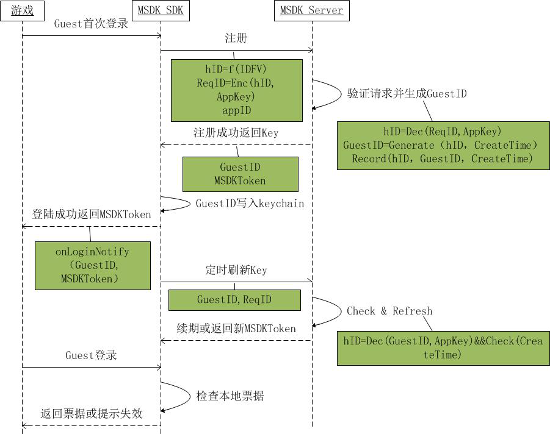

Guest 모드
===

##포함한 내용과 기능 
 - MSDK Guest 모드에서 MSDK 기존 기능 배치는 다음과 같다:

---

##로그인 시퀀스 다이어그램
 - Guest 모드에서 로그인은 등록과 로그인 시퀀스로 나누지만 두 씬의 차이성은 MSDK에 의해 차단되기에 게임은 둘을 구별할 필요가 없다. 이곳에서는 방안만 설명한다.

---

##프로세스 비교
 - OpenID 체계와 Guest 모드 프로세스 비교:

---

##필요한 변동
###Step1:Guest 모드 로그인 방법
 - 다음 코드 호출
```ruby
WGPlatform* plat = WGPlatform::GetInstance();
    //OB가 설정되지 않으면 먼저 설정
    MyObserver* ob = new MyObserver();
    plat->WGSetObserver(ob);
    plat->WGSetPermission(eOPEN_ALL);
    plat->WGLogin(ePlatform_Guest);
```

- 2.4.0i 및 이후버전에는 delegate방식을 사용 가능하며 코드는 아래와 같다：
```
[MSDKService setMSDKDelegate:self];
MSDKAuthService *authService = [[MSDKAuthService alloc] init];
[authService setPermission:eOPEN_ALL];
[authService login:ePlatform_Guest];
```

###Step2:onLoginNotify 콜백
 - onLoginNotify에서 리턴한 LoginRet:
 
등록 오류(eFlag_Guest_RegisterFailed)를 리턴하면 WGResetGuestID를 호출한 후 등록 요청을 다시 시작할 것을 제안한다[결함 내성 메커니즘 추가]. 등록 성공 후 획득한 GuestID는 Keychain에 기록되어 App를 삭제한 후 다시 설치해도 게스트 진행률을 잃어버리지 않는다.

- - 2.4.0i 및 이후 버전에는 delegate방식으로 콜백 가능하며 코드는 아래와 같다：
```
-(void)OnLoginWithLoginRet:(MSDKLoginRet *)ret
{
    //내부 실현 로직은 void MyObserver::OnLoginNotify(LoginRet& loginRet)와 같다
}
```

###Step3:결제 방법
 - 결제는 이전과 마찬가지로 registerPay->pay지만 파라미터가 조금 다르다. session_id와 session_type의 값에 의한 전달에 주의해야 한다.
```ruby
registerPay：
 WGPlatform* plat = WGPlatform::GetInstance();
    if (!plat->WGIsSupprotIapPay())
    {
        NSLog(@"iap결제를 지원하지 않음");
        return;
    }
    
    LoginRet ret;
    int retCode = plat->WGGetLoginRecord(ret);
    //    plat->WGRegisterPay();
    std::string openid = ret.open_id;
    std::string paytoken;    
    std::string sessionId;
    std::string sessionType;    
    if (retCode == ePlatform_Guest)
    {
        for(int i=0;i<ret.token.size();i++)
        {
            TokenRet* pToken = &ret.token[i];
            if(pToken->type == eToken_Guest_Access)
            {
                paytoken = pToken->value;
                break;
            }
        }
        sessionId = "hy_gameid";
        sessionType = "st_dummy";
    }
    std::string pf = plat->WGGetPf();
    std::string pfKey = plat->WGGetPfKey();    
    plat->WGRegisterPay(
                        ((unsigned char*)"1450000495"),
                        (unsigned char *)openid.c_str(),
                        (unsigned char *)paytoken.c_str(),
                        (unsigned char *)sessionId.c_str(),
                        (unsigned char *)sessionType.c_str(),
                        NULL
                        );
Pay：
    WGPlatform* plat = WGPlatform::GetInstance();
    if (!plat->WGIsSupprotIapPay())
    {
        NSLog(@"iap 결제를 지원하지 않음");
        return;
    }
    LoginRet ret;
    int retCode = plat->WGGetLoginRecord(ret);
    std::string openid = ret.open_id;
    std::string paytoken;
    
    std::string sessionId;
    std::string sessionType;
    if (retCode == ePlatform_Guest)
    {
        for(int i=0;i<ret.token.size();i++)
        {
            TokenRet* pToken = &ret.token[i];
            if(pToken->type == eToken_Guest_Access)
            {
                paytoken = pToken->value;
                break;
            }
        }
        sessionId = "hy_gameid";
        sessionType = "st_dummy";
    }
    
    std::string pf = "desktop_m_qq-10001-iap-10001";//plat->WGGetPf();
    std::string pfKey = "abcdefg";//plat->WGGetPfKey();
    
    plat->WGSetIapEnvirenment((unsigned char*)"test");//test 샌드 박스 환경으로 설정 release 기존 네트워크 환경[보충 주석]
    unsigned char * payItem = (unsigned char*)PayPayitem;
    unsigned char * productId = (unsigned char*)PayProductid;
    
    bool isDepositGameCoin = true;
    uint32_t productType = 0;
    uint32_t quantity = 1;
    unsigned char * zoneId = (unsigned char*)"1";
    unsigned char * varItem = (unsigned char*)"com.lightspeed.weshoothd.600*1";
    
    MyObserver* ob = new MyObserver();
    plat->WGSetObserver(ob);
    
    plat->WGSetIapEnalbeLog(true);
    
    plat->WGPay(
                ((unsigned char*)"1450000495"),
                (unsigned char *)openid.c_str(),
                (unsigned char *)paytoken.c_str(),
                (unsigned char *)sessionId.c_str(),
                (unsigned char *)sessionType.c_str(),
                payItem, productId,
                isDepositGameCoin, productType,
                quantity,
                zoneId,
                varItem,
                (unsigned char*)"dsafasdfa"
                ); 
```

###Step4:호출하면 안되는 함수 호출
 - 	상응한 콜백에서 eFlag_InvalidOnGuest를 반환한다.

###Step5:Guest 계정 재설정 방법
 - 	GameServer에서 관련 데이터를 제거한 후 아래 코드를 호출하여 MSDK가 단말기에 남긴 Guest 계정 데이터를 제거할 수 있다. 다음번에 Guest 모드에 로그인하면 새로운 Guest 계정이 생성된다.
```ruby
WGPlatform* plat = WGPlatform::GetInstance();
plat->WGResetGuestID();
```

- 2.4.0i 및 이후버전에는 delegate방식을 사용 가능하며 코드는 아래와 같다：
```
[MSDKService setMSDKDelegate:self];
MSDKAuthService *authService = [[MSDKAuthService alloc] init];
[authService resetGuestId];
```