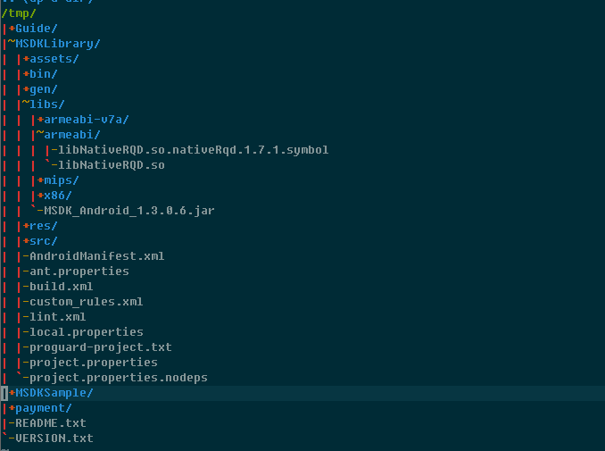

Android 接入
=======

## Step1: 包结构说明
MSDK的发布包(zip)主要包含两个重要部分, MSDKLibrary和MSDKSample, 前者为MSDK库, 后者应用前者, 是MSDK的使用实例. 用ant构建MSDKSample即可获得可执行的apk包存于MSDKSample/bin下.
MSDK主体以Android Library Project的形式提供, 游戏引入MSDKLibrary即可使用, MSDKLibrary中包含了: 所需要的jar包, so文件, 资源文件. 包的目录结构如下图:


## Step2: 引入MSDK库
在Eclipse中引入MSDKLibrary项目, 右击游戏项目->属性->Android->添加(库)->选择MSDKLibrary, 完成对MSDKLibrary的引用. 不能使用Android Library Project的游戏, 需要复制libs, res两个目录到游戏工程相应目录.
	复制MSDKLibrary/jni目录下的jni的.cpp和.h文件加到游戏工程, 并添加到makefile.
	注意事项:
	引入MSDKLibrary以后编译发生包冲突(重复), 因为MSDK里面已经包含了 微信SDK(libammsdk.jar), QQ互联sdk(open_sdk.jar), MTA(mta-xxx.jar), 灯塔SDK(beacon-xxx.jar), 切上述sdk均是其最新稳定版, 游戏如果以前有单独集成这些SDK, 请删除之前集成的jar包.

## Step3: 配置说明
a)权限配置

```
<!-- TODO SDK接入必须权限模块 START -->
<uses-permission android:name="android.permission.ACCESS_NETWORK_STATE" />
<uses-permission android:name="android.permission.ACCESS_WIFI_STATE" />
<uses-permission android:name="android.permission.ACCESS_FINE_LOCATION" />
<uses-permission android:name="android.permission.CHANGE_WIFI_STATE" />
<uses-permission android:name="android.permission.GET_TASKS" />
<uses-permission android:name="android.permission.INTERNET" />
<uses-permission android:name="android.permission.MOUNT_UNMOUNT_FILESYSTEMS" />
<uses-permission android:name="android.permission.READ_PHONE_STATE" />
<uses-permission android:name="android.permission.RESTART_PACKAGES" />
<uses-permission android:name="android.permission.SYSTEM_ALERT_WINDOW" />
<uses-permission android:name="android.permission.WRITE_EXTERNAL_STORAGE" />
<!-- TODO SDK接入 必须权限模块 END -->
```

在assets/msdkconfig.ini中配置访问的需要访问的MSDK后台环境(测试环境/正式环境), 联调阶段游戏需要使用测试环境, 发布时需要切换到正式环境(公司内测, 公测, 正式上线), 切换环境时候需要注意, 后台也要同时切换成对应的环境. 下面是配置前端访问MSDK后台测试环境. 

	;自研游戏或精品代理游戏请使用此组域名, 使用其中一个域名
	;带msdktest为测试环境域名, msdk为正式环境域名
	;MSDK_URL=http://msdk.qq.com
	;MSDK_URL=http://msdkdev.qq.com
	MSDK_URL=http://msdktest.qq.com
	
PS: 为了防止游戏用测试环境上线, SDK内检测到游戏使用测试环境或者开发环境时, 会Toast出类似: “You are using http://msdktest.qq.com” 这样的提示, 游戏切换成正式环境域名以后此提示自动消失.

## Step4: Java层初始化
	public void onCreate(Bundle savedInstanceState) {
	...
	//游戏必须使用自己的QQ AppId联调
		baseInfo.qqAppId = "1007033***";
		baseInfo.qqAppKey = "4578e54fb3a1bd18e0681bc1c7345***";

	//游戏必须使用自己的微信AppId联调
		baseInfo.wxAppId = "wxcde873f99466f***"; 
		baseInfo.wxAppKey = "bc0994f30c0a12a9908e353cf05d4***";

	//游戏必须使用自己的支付offerId联调
		baseInfo.offerId = "100703***";
	WGPlatform.Initialized(this, baseInfo);
	// 必须保证handleCallback在Initialized之后
	WGPlatform.handleCallback(getIntent());
	...
	}
	@Override
	protected void onNewIntent(Intent intent) {
	super.onNewIntent(intent);
	// 处理外部唤起游戏, 和授权返回的数据
	WGPlatform.handleCallback(intent); 
	}

	// 为了保证登录数据上报准确, 游戏必须在完成如下配置
	@Override
	protected void onPause() {
	    super.onPause();
	    WGPlatform.onPause();
	}
	@Override
	protected void onResume() {
	    super.onResume();
	    WGPlatform.onResume();
	}
	@Override
	protected void onDestroy() {
	super.onDestroy();
	WGPlatform.onDestory(this);
	}

此外，需要在MainActivty中加载必要的动态库，示例代码如下：

	// TODO GAME 要加载必要的动态库
	static {
	// 游戏需要加载此动态库, 数据上报用
	System.loadLibrary("NativeRQD"); 
	// 游戏不需要这个, 这是MSDKSample自用的
	System.loadLibrary("WeGameSample");
	}

## Step5: C++ 层初始化(只使用Java API的游戏无需可跳过此段)
所有WG开头的接口均提供了C++层和Java层接口. Java层通过WGPlatform调用, C++层通过WGPlatform::GetInstance()调用. 这里调用方式可以参考jni/PlatformTest.cpp. SDK需要设置一个全局的回调, 在授权返回, 分享返回时均会进行相应的回调. 设置的回调对象实现自WGPlatformObserver, 在初始化时传入此对象. 示例代码如下:

	GlobalCallback g_Test;
	JNIEXPORT jint JNICALL JNI_OnLoad(JavaVM* vm, void* reserved) {
	    WGPlatform::GetInstance()->init(vm);// C++层初始化SDK
	    WGPlatform::GetInstance()->WGSetObserver(&g_Test);
	    return JNI_VERSION_1_4;
	}
   
## Step6: 设置全局回调
MSDK通过WGPlatformObserver抽象类中的方法将授权、分享或查询结果回调给游戏。游戏根据回调结果调正UI等。只有设置回调，游戏才能收到MSDK的响应。
设置Java 回调：

	WGPlatform.WGSetObserver(new WGPlatformObserver() {
		@Override
		public void OnWakeupNotify(WakeupRet ret) { }
		@Override
		public void OnShareNotify(ShareRet ret) { }
		@Override
		public void OnRelationNotify(RelationRet relationRet) { }
		@Override
		public void OnLoginNotify(LoginRet ret) { }
	});

设置C++ 回调(设置了Java层回调会优先调用Java层回调, 如果要使用C++层回调则不能设置Java层回调)：

	class GlobalCallback: public WGPlatformObserver {
	public:
	    virtual void OnLoginNotify(LoginRet& loginRet) { }
	    virtual void OnShareNotify(ShareRet& shareRet) { }
	    virtual void OnWakeupNotify(WakeupRet& wakeupRet) { }
	    virtual void OnRelationNotify(RelationRet& relationRet) { }
	    virtual ~GlobalCallback() { }
	};
	GlobalCallback g_Test;

	JNIEXPORT jint JNICALL JNI_OnLoad(JavaVM* vm, void* reserved) {
		// C++层初始化, 必须在游戏主Activity的onCreate之前被调用
		WGPlatform::GetInstance()->init(vm);
		WGPlatform::GetInstance()->WGSetObserver(&g_Test);
		return JNI_VERSION_1_4;
	}

**注: 如果游戏使用C++ API, 则不要再设置Java层的全局回调, SDK会优先调用Java层的回调, 有Java层回调则会忽略C++层回调.另外MSDK的回调在UI线程, 开发者需自己确保线程安全。**
	
至此, 游戏可以开始调用MSDK API文档中提到的所有API.