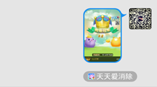

MSDK 异账号问题汇总
=======

何为异帐号
---

异帐号是指：当前游戏内登录的帐号和平台登录的帐号不一致。有以下两种情况：

1. 平台一样，帐号不同（例如游戏和手Q登录了不同的QQ号）
2. 平台不同（例如游戏用微信登录，游戏相关的操作是要到手Q）

异帐号的场景
---

1. 游戏分享消息的时候拉起平台，因为账号不一致，平台会弹框提示异账号，目前平台都已经支持该功能。

 

2. 用户从平台拉起进入游戏，因为账号不一致，需要游戏弹框提示异账号

 

`目前游戏上线时平台要求游戏处理的异账号、MSDK实现的异帐号都为第二种。`

异帐号处理逻辑（开发关注）
---
MSDK的异帐号处理逻辑包括异账号判断，用户选择账号，异账号登录三个步骤。（详见MSDK接入文档）。简单介绍如下：

####1. 异帐号判断：

当游戏从外部平台拉起的时候，MSDK会在handCallback判断拉起平台与游戏本地账号是否存在异账号，并将异账号判断的结果通过OnWakeupNotify(WakeupRet ret)方法的ret.flag回调给游戏。游戏可以根据回调结果完成对应的登陆处理。具体ret.flag及对应的处理如下：

	eFlag_Succ: 不存在异账号，使用本地账号登陆成功。 游戏接收到此flag以后直接读取LoginRet结构体中的票据进行游戏授权流程。

	eFlag_AccountRefresh: 不存在异账号，MSDK已通过刷新接口将本地账号票据刷新。接收到此flag以后直接读取LoginRet结构体中的票据进行游戏授权流程。

	eFlag_UrlLogin：不存在异账号，游戏通过拉起账号快速登陆成功。游戏接收到此flag以后直接读取LoginRet结构体中的票据进行游戏授权流程。

	eFlag_NeedLogin：游戏本地账号和拉起账号均无法登陆。游戏接收到此flag以后需要弹出登陆页让用户登陆。

	eFlag_NeedSelectAccount：游戏本地账号和拉起账号存在异账号，游戏接收到此flag以后需要弹出对话框让用户选择登陆的账号。

####2. 用户选择：

当异账号判断的ret.flag为eFlag_NeedSelectAccount时，游戏需要弹框提示用户，选择本地账号或者拉起账号登陆游戏，游戏需要根据用户选择的结果调用接口WGSwitchUser完成用户登陆。

		/**
		 *  通过外部拉起的URL登陆。该接口用于异帐号场景发生时，用户选择使用外部拉起帐号时调用。
	 	*  登陆成功后通过onLoginNotify回调
	 	*
	 	*  @param flag 为YES时表示用户需要切换到拉起帐号，此时该接口会使用上一次保存的拉起帐号登陆数据登陆。登陆成功后通过onLoginNotify回调；如果没有票据，或票据无效函数将会返回NO，不会发生onLoginNotify回调。
	 	*              为NO时表示用户继续使用原帐号，此时删除保存的拉起帐号数据，避免产生混淆。
	 	*
	 	*  @return 如果没有票据，或票据无效将会返回NO；其它情况返回YES
		 */
		bool WGSwitchUser(bool flag);

####3. 返回登录回调：

MSDK会根据用户选择的结果尝试登录，并把登录的结果通过onLoginNotify回调给游戏，游戏根据回调结果处理登录结果。

平台到游戏异帐号的九种情况
----

开发无需关心，只需要关心MSDK给游戏回调中的flag。：

|           |拉起带完整票据|拉起不带完整票据|拉起无票据|
|: ------------- :|: ------------- :|: ------------- :|: ------------- :|
|本地票据有效|提示用户异账号|提示用户异账号|通过本地帐号登陆|
|本地票据无效|提示用户异账号|提示用户异账号|游戏回到登录页|
|本地无票据|通过拉起账号登陆|游戏回到登录页|游戏回到登录页|

手Q拉起游戏场景
---

手Q的结构化消息分享和后端分享可以有不同的跳转链接（tatgetURL），不同游戏可以填入不同的跳转链接来实现通过分享消息拉起游戏的场景。

1. 通过手Q游戏中心点启动拉起游戏

	效果：此时会带票据拉起游戏

	MSDK对应的接口：无

2. 通过手Q结构化消息结构体拉起游戏

	效果：取决于填写的targetURL，详细内容看下一部分（手Q结构化消息的跳转链接设置）

	MSDK对应的接口：WGSendToQQGameFriend，WGSendToQQ，WGSendToQQWithMusic

   

3. 通过手Q结构化消息或者大图分享的小尾巴拉起游戏

	效果：会拉起游戏，但是不带任何票据，包括openID，无法做异帐号提示

	MSDK对应的接口：WGSendToQQGameFriend，WGSendToQQ，WGSendToQQWithMusic，WGSendToQQWithPhoto

    

手Q结构化消息跳转链接设置
---
1. 通过PR2评审的游戏

	链接配置：可以将跳转链接设置为手Q游戏中心的游戏详情页（详见MSDK接入文档）

	对应情况：此种情况等价于在游戏中心点击启动游戏拉起游戏。通过在游戏中心的不同配置（配置方法看下一部分）可以实现带票据拉起游戏或者不带票据拉起游戏

2. 没有通过PR2评审的游戏

	链接配置：可以将跳转链接设置为应用宝详情页（具体可以咨询应用宝vivianhui）

	对应情况：可以拉起游戏或者下载游戏

3. 即没有通过PR2又不接应用宝的游戏

	链接配置：跳转链接只能设置为其他链接

	对应情况：点击消息会跳转到对应的网址，游戏可以在网址自己做游戏的下载或者web拉起

手Q游戏中心快速登陆配置
---

这部分由游戏的**`运营协同规划PM`**提交需求给手Q游戏中心，由游戏中心的负责人完成配置。

1. 支持openID：

	勾选openID一项，如下图

 
2. 支持带openID、accessToken、PayToken

	1.勾选对应的选项

	2.填写游戏支持异帐号的版本对应的versionCode。填写以后此code及以上的版本可以带票据拉起游戏，之前版本只会带openID拉起游戏，不会影响游戏的正常逻辑。
 

3. 注意事项

	在配置的时候一般只需要配置前三项即可，后面几项不用配置。

注意事项
-----
####游戏到平台异账号：

1. 1.3.0.11 以下版本，游戏到微信的异账号因为MSDK已知BUG会造成自动登录没有提示。建议更新MSDK版本到1.3.0.11以后解决此问题.
2. 游戏到微信的异账号只在微信5.0及以上版本才支持。

####平台到游戏异账号：
1. MSDK从1.8.0开始支持异账号，目前只有手Q可以完成带票据拉起。
2. 手Q4.6以下版本， 手Q到游戏的异账号在游戏已经启动的情况下没有。

####手Q支持快速登录的条件：
1. 游戏分享消息的跳转链接为游戏中心详情页。
2. 游戏在手Q游戏中心配置了透传给APP的字段（openid,accesstoken,paytoken）